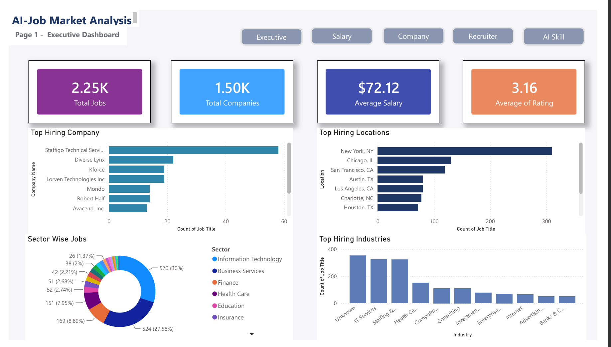
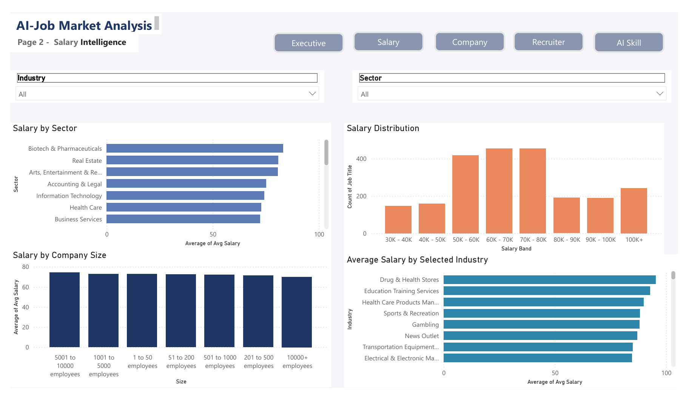
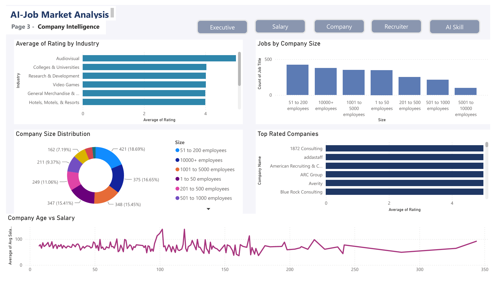
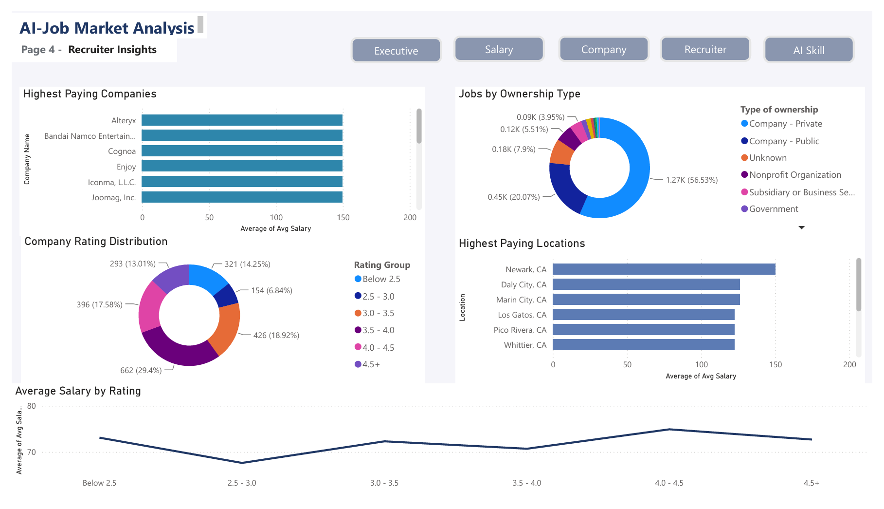
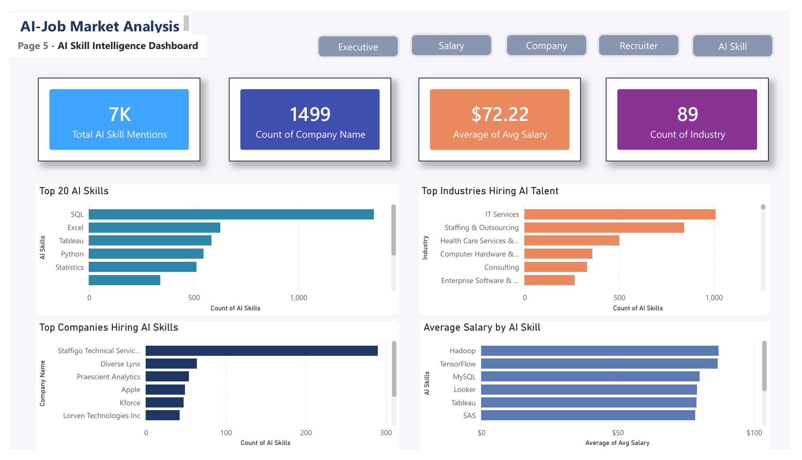

# AI Job Market Analysis

## Overview

AI Job Market Analysis is an end-to-end Data Analytics project built using **Python, SQL, and Power BI**. The project analyzes AI and Data Analytics job postings to uncover salary trends, hiring patterns, company insights, recruiter activity, and the most in-demand technical skills.

The project demonstrates the complete analytics workflow—from data cleaning and feature engineering to SQL analysis and interactive dashboard creation.

---

## Problem Statement

With the rapid growth of Artificial Intelligence, companies are hiring professionals with diverse technical skills. This project aims to answer questions such as:

* Which AI skills are most in demand?
* Which companies hire the most AI professionals?
* What are the salary trends across different job roles?
* Which recruiters and industries are hiring the most?
* What insights can job seekers gain from the current AI job market?

---

## Tech Stack

* **Python** (Pandas, Regular Expressions)
* **SQL (MySQL)**
* **Power BI**
* **Git & GitHub**

---

## Project Workflow

1. Data Cleaning using Python
2. Salary Feature Engineering
3. AI Skill Extraction from Job Descriptions
4. SQL Data Analysis
5. Interactive Power BI Dashboard
6. GitHub Project Deployment

---

## Dashboard Pages

### Executive Dashboard

* Total Jobs
* Average Salary
* Average Company Rating
* KPI Cards
* Hiring Trends

### Salary Intelligence

* Salary Distribution
* Average Salary by Company
* Highest Paying Roles

### Company Intelligence

* Top Hiring Companies
* Company Ratings
* Industry Analysis

### Recruiter Insights

* Hiring Companies
* Job Distribution
* Recruiter Activity

### AI Skills Intelligence

* Top AI Skills
* Skill Frequency
* AI Technology Demand

---

## Key Insights

* SQL is the most frequently required technical skill.
* Python is one of the highest-demand programming languages.
* Tableau and Power BI are widely required for analytics roles.
* Machine Learning demand continues to increase.
* Technology companies dominate AI hiring.

---

## Dataset

The dataset contains over **2,200 job postings** with information such as:

* Job Title
* Company Name
* Salary Estimate
* Company Rating
* Industry
* Sector
* Job Description
* AI Skills
* Company Age

---

## Repository Structure

```text
AI-Job-Market-Analysis/
│
├── data/
├── python/
├── sql/
├── powerbi/
├── images/
├── README.md
├── LICENSE
└── requirements.txt

```
## 📊 Dashboard Preview

### Executive Dashboard



---

### Salary Intelligence Dashboard



---

### Company Intelligence Dashboard



---

### Recruiter Insights Dashboard



---

### AI Skills Intelligence Dashboard



---

## Future Improvements

* Machine Learning Salary Prediction
* AI Job Recommendation System
* Real-Time Job Market Dashboard
* Automated Data Pipeline

---

## Author

**Shankar Yawalkar**

Aspiring Data Analyst | Python | SQL | Power BI | Data Analytics

GitHub: https://github.com/shankaryawalkar6-wq
